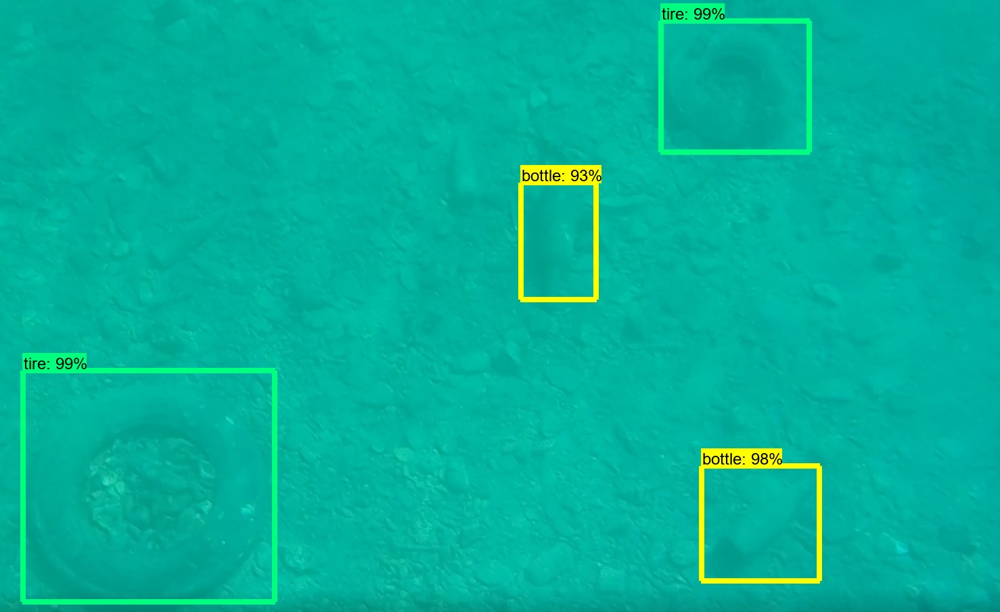
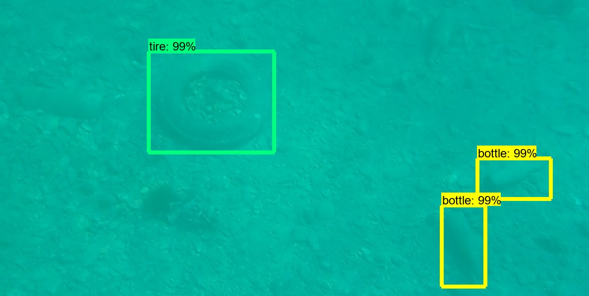
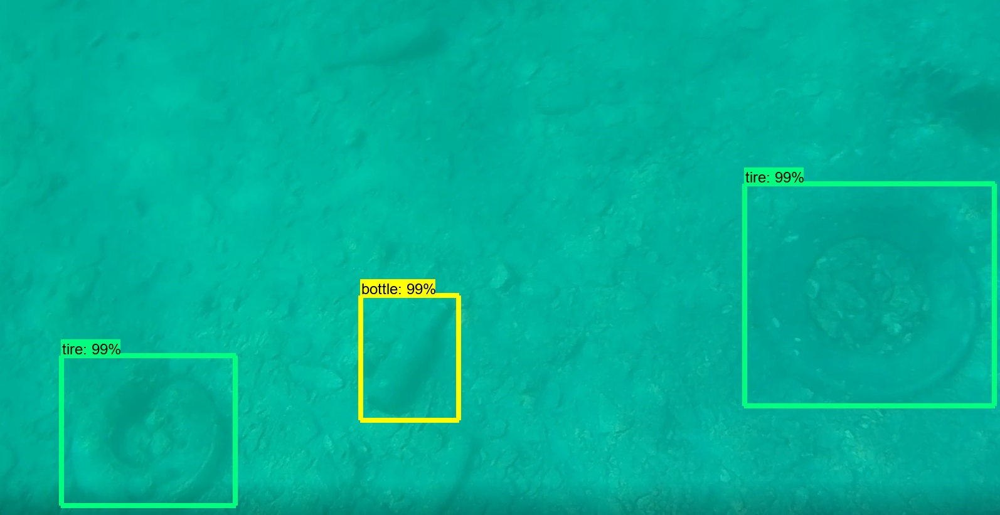
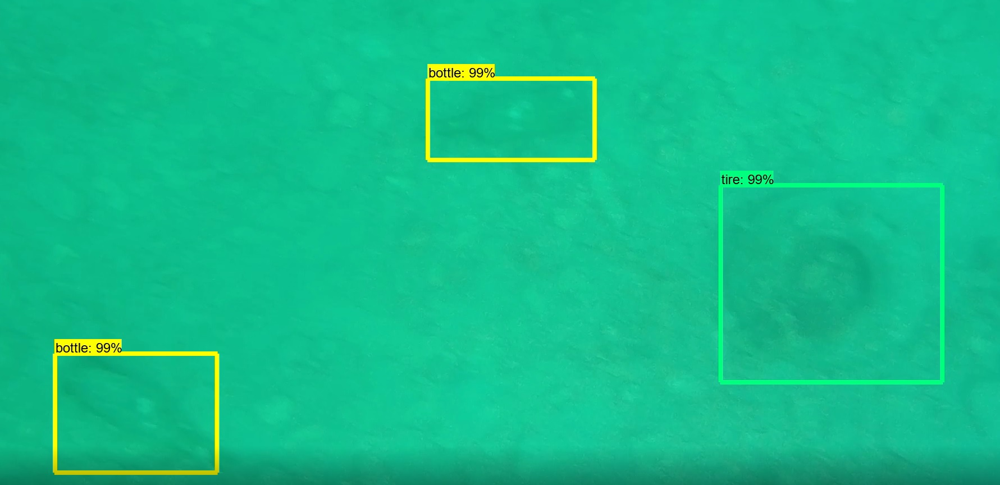
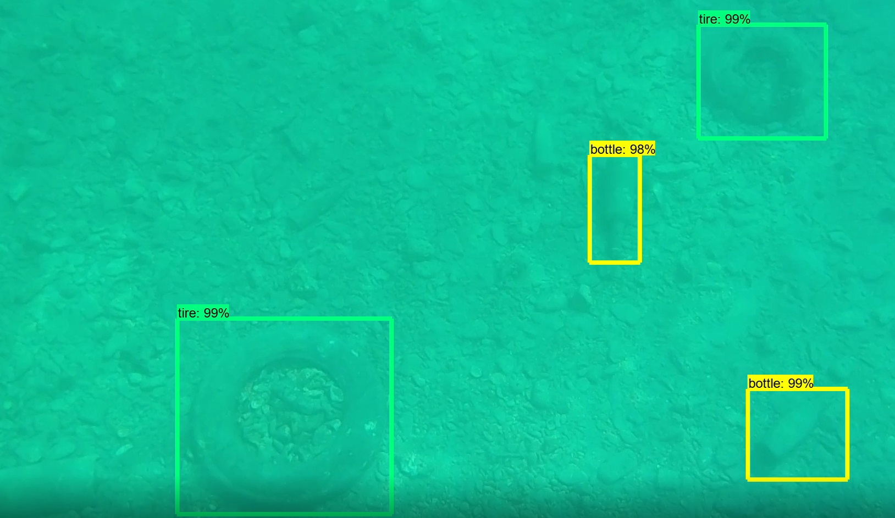
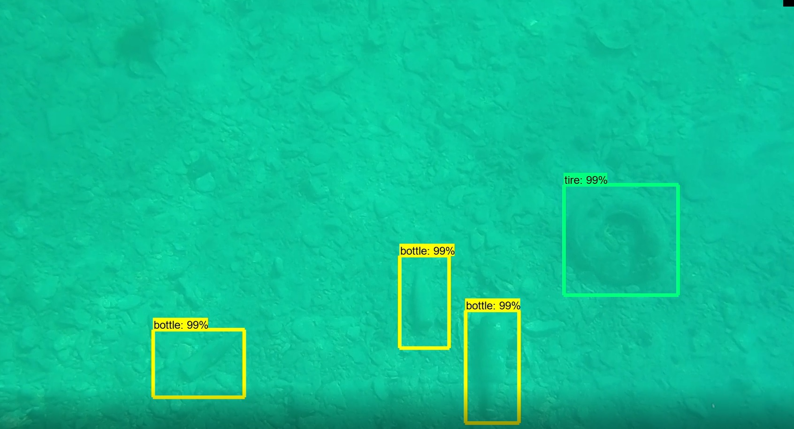
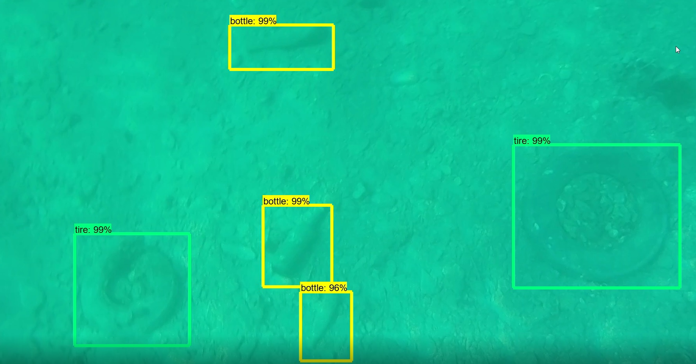

# Object-detection-of-sea-waste-bottles-and-tires-
## Tensorflow Object Detection API - Sea waste (bottles and tires) 

It was done by following instructions from [EdjeElectronics Tensorflow Object Detection API](https://github.com/EdjeElectronics/TensorFlow-Object-Detection-API-Tutorial-Train-Multiple-Objects-Windows-10)

I obtained most of the pictures by diving and taking pictures in the sea, all of those are presented in images/train and images/test. 
Other source is [UPA Rostrum Split](https://www.facebook.com/uparostrum/) facebook page and some pictures from [Google](https://www.google.com/) which i did not commit to repository.

Below attached are photos of some tested examples  which i obtained while diving.

#### Example 1

#### Example 2

#### Example 3

#### Example 4

#### Example 5

#### Example 6

#### Example 7

